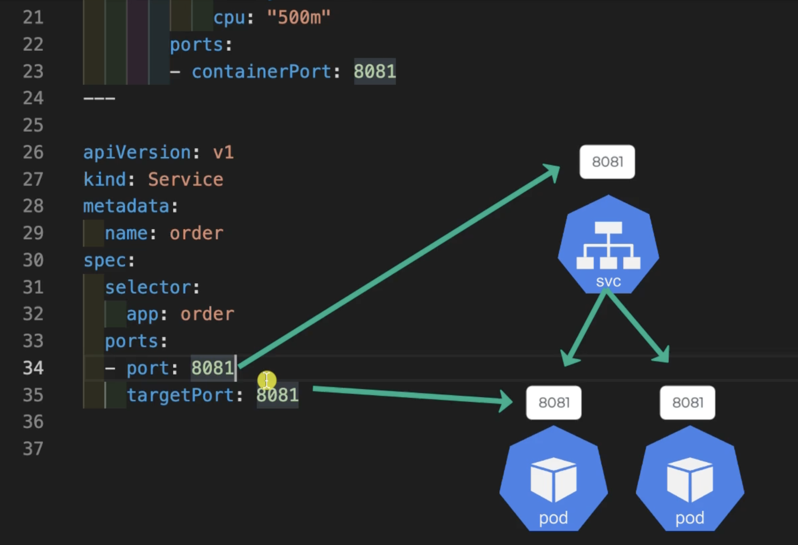
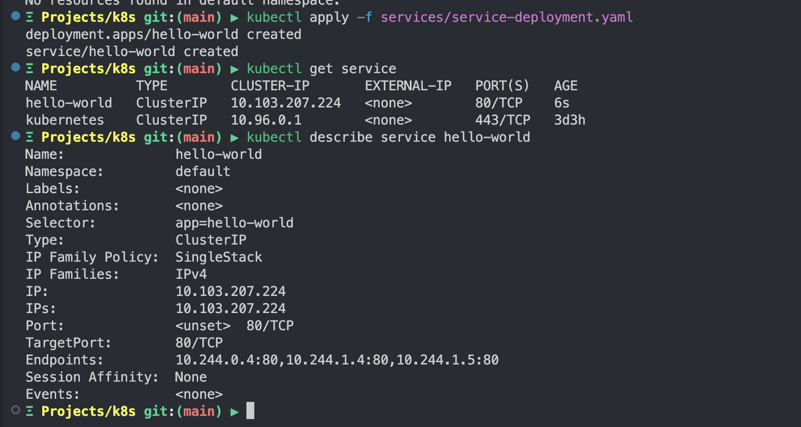
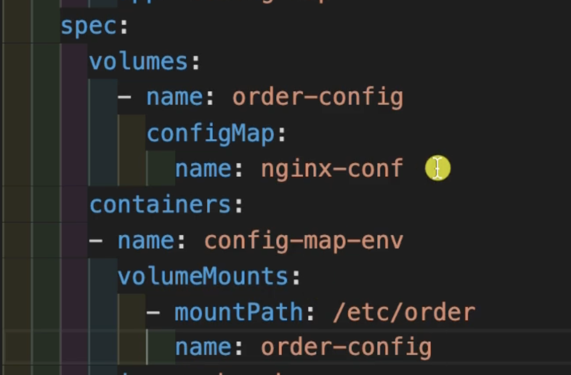
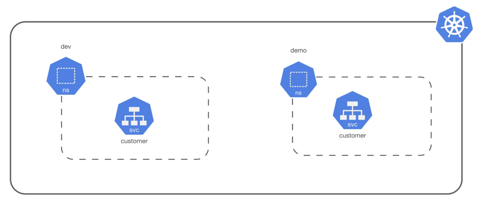

# k8s ⚡ 101

```bash
minikube start
```


```bash
kubectl run hello-world --image=amigoscode/kubernetes:hello-world --port=80
kubectl port-forward --port=8080
```


```bash
kubectl delete pod hello-world
kubectl get pods
kubectl get pods -A
```


```bash
minikube ssh
minikube stop
minkube delete

minikube start --nodes=2
```


```bash
minikube get nodes
minikube ip
minikube ip --node=minikube-m01
minikube stats
minikube logs
minikube logs -f
minkube logs --node=minikube-m01 -f
```

## Pod

Smallest deployable unit - part of a node. ie worker node. The control plane (master node) has its on unique pods necessary for running k8 functionalities.


```yaml
apiVersion: v1
kind: Pod
metadata:
  name: hello-world
  labels:
    name: hello-world
spec:
  containers:
  - name: hello-world
    image: amigoscode/kubernetes:hello-world
    resources:
      limits:
        memory: "128Mi"
        cpu: "500m"
    ports:
      - containerPort: 80
```

```bash
kubectl apply -f pod.yaml # create pod declaratively
cat pod.yaml | kubectl apply -f - # apply from piped content
kubectl apply -f . # apply all k8 resource files
kubectl get pods -w # watch the running status of pods as they update

kubectl delete -f pod.yaml 
```


```bash
kubectl get all # get all resources. shows the clusters
kubectl get all -A # get all resources including pods, services with clusters etc

kubectl get pods -n kube-system # pods for only kube-system namespace. Excludes default
kubectl get all -n kube-system
kubectl get namespaces # or
kubectl get ns

kubectl describe pod hello-world # describe pod
kubectl get pod hello-world -o wide # describes pod in one line. --output
# wide, json, yaml
```

**Logs**

```bash
kubectl logs hello-world
kubectl logs hello-world -f

# to target the logs for a specific container inside the pod,
kubectl logs hello-world -c hello-world
```


**A pod with two containers**

```yaml
apiVersion: v1
kind: Pod
metadata:
  name: hello-world
  labels:
    name: hello-world
spec:
  containers:
  - name: hello-world
    image: amigoscode/kubernetes:hello-world
    resources:
      limits:
        memory: "128Mi"
        cpu: "500m"
    ports:
      - containerPort: 80
	- name: ola-mundo
    image: amigoscode/kubernetes:hello-world
    resources:
      limits:
        memory: "128Mi"
        cpu: "500m"
    ports:
      - containerPort: 82
```

**Executing** **commands**

```yaml
kubectl exec -it hello-world -- sh
#_

kubectl exec -it hello-world -c hello-world -- /bin/sh
kubectl exec hello-world -- ls

kubectl api-resources
```

cheat sheet [here](https://kubernetes.io/docs/reference/kubectl/cheatsheet/)

### Deployments

```yaml
apiVersion: apps/v1
kind: Deployment
metadata:
  name: hello-world
spec:
  selector:
    matchLabels:
      app: hello-world
  template:
    metadata:
      labels:
        app: hello-world
    spec:
      containers:
      - name: hello-world
        image: amigoscode/kubernetes:hello-world
        resources:
          limits:
            memory: "128Mi"
            cpu: "500m"
        ports:
        - containerPort: 80
```

```bash
kubectl apply -f deployments/deployment.yaml
kubectl get po
kubectl get deployments
kubectl describe deployments hello-world
kubectl delete deployment hello-world
```

### ReplicaSet w/ Deployment

By default, a deployment comes with one replicaset

```bash
kubectl get replicaset # or rs
kubectl port-forward deployment/hello-world 8081:80
```


```bash
...
# add to deployment file
spec:
  replicas: 3
...

kubectl apply -f deployments/deployment.yaml
kubectl get pods
# or use this to get all stats together
kubectl get all
```


```bash
kubectl describe rs hello-world

kubectl rollout history deployment hello-world
kubectl rollout undo deployment hello-world
```


**Services**


**selector: 
    app: order** 

should match the **template / metadata / labels / app** for the node definition



```yaml
apiVersion: apps/v1
kind: Deployment
metadata:
  name: hello-world
spec:
  replicas: 3
  selector:
    matchLabels:
      app: hello-world
  template:
    metadata:
      labels:
        app: hello-world
    spec:
      containers:
      - name: hello-world
        image: amigoscode/kubernetes:hello-world
        resources:
          limits:
            memory: "128Mi"
            cpu: "500m"
        ports:
        - containerPort: 80
---
apiVersion: v1
kind: Service
metadata:
  name: hello-world
spec:
  type: ClusterIP
  selector:
    app: hello-world # matches template/metadata/labels app on deployment definition
  ports:
  - port: 80 # routes to this service
    targetPort: 80 # must match the containerPort on node deployment definition
```

```bash
kubectl apply -f service-deployment.yml

kubectl get service
kubectl describe service hello-world
```



NB: The **Endpoints** section inside the describe commands shows the ip of the the pod replicas.

```bash
kubectl get endpoints # or kubectl get ep
# output
NAME          ENDPOINTS                                   AGE
hello-world   10.244.0.4:80,10.244.1.4:80,10.244.1.5:80   8m38s
kubernetes    192.168.58.2:8443                           3d3h
```

NodePort, LoadBalancer

```yaml
apiVersion: apps/v1
kind: Deployment
metadata:
  name: frontend
spec:
  replicas: 2
  selector:
    matchLabels:
      app: frontend
  template:
    metadata:
      labels:
        app: frontend
    spec:
      containers:
      - name: frontend
        image: amigoscode/kubernetes:frontend-v1
        resources:
          limits:
            memory: "128Mi"
            cpu: "500m"
        ports:
        - containerPort: 80

---

apiVersion: v1
kind: Service
metadata:
  name: frontend
spec:
  type: LoadBalancer
  selector:
    app: frontend
  ports:
  - port: 80
    targetPort: 80
```

```bash
kubectl get svc -w # watch the LoadBalancer service assigned external IP

# in a different terminal
minikube tunnel
```

### Labels

```yaml
...
template:
    metadata:
      labels:
        app: frontend
				 environment: test
				 department: engineering
```

```bash
kubectl get pods --show-labels
kubectl get pods --selector="department=engineering"
kubectl get pods --selector="department=engineering,environment=test"
kubectl get pods -l department=engineering,environment=test # same result

# you can define labels on several nodes, and use the selector ie on a service to 
# target the label on the nodes

minikube service hello-world

kubectl get pods -l 'department in (engineering), environment notin (test, production)'
```

### Volumes

```yaml
apiVersion: apps/v1
kind: Deployment
metadata:
  name: empty-dir-app
spec:
  selector:
    matchLabels:
      app: empty-dir-app
  template:
    metadata:
      labels:
        app: empty-dir-app
    spec:
      volumes: # define volume here
        - name: cache
          emptyDir: {}
				 - name: doc
					 hostPath:
							path: /var/log
      containers:
      - name: one
        image: busybox
        command:
          - "/bin/sh"
        args:
          - "-c"
          - "touch /foo/bar.txt && sleep 3600"
        resources:
          limits:
            memory: "128Mi"
            cpu: "500m"
        volumeMounts: # mount the volume here
          - name: cache
            mountPath: /foo
      - name: two
        image: busybox
        command:
          - "sleep"
          - "3600"
        resources:
          limits:
            memory: "128Mi"
            cpu: "500m"
        volumeMounts: # mount the volume here
          - name: cache
            mountPath: /foo
```

```bash
▶ kubectl apply -f deployments/volume-deployment.yaml
deployment.apps/empty-dir-app created

▶ kubectl get po -w
NAME                             READY   STATUS        RESTARTS      AGE
empty-dir-app-5785c8d45d-4xc8n   1/2     Terminating   3 (52s ago)   70s
empty-dir-app-7d9f8885d5-rxkkz   2/2     Running       0             5s
empty-dir-app-5785c8d45d-4xc8n   0/2     Terminating   3             86s
empty-dir-app-5785c8d45d-4xc8n   0/2     Terminating   3             87s
empty-dir-app-5785c8d45d-4xc8n   0/2     Terminating   3             87s

▶ kubectl exec -it empty-dir-app-7d9f8885d5-rxkkz -c one -- bin/sh
/ # ls
bin    dev    etc    foo    home   lib    lib64  proc   root   sys    tmp    usr    var
/ # cd foo/
/foo # ls
bar.txt
/foo # cat bar.txt 
/foo #
```

When you exec into container two, you should file the same file there since both share the same volume and volume mount path.  

### Config Map

```yaml
apiVersion: v1
kind: ConfigMap
metadata:
  name: app-properties
data:
  app-name: Cintra
  app-version: 1.0.0
  app-description: Pipeline tunneling with AI
  app-owner: CoFex
```

```bash
▶ kubectl apply -f services/service-config-map.yaml
configmap/app-properties created
▶ kubectl get cm
NAME               DATA   AGE
app-properties     4      8s
kube-root-ca.crt   1      11d
▶ kubectl describe configmaps app-properties
Name:         app-properties
Namespace:    default
Labels:       <none>
Annotations:  <none>

Data
====
app-name:
----
Cintra
app-owner:
----
CoFex
app-version:
----
1.0.0
app-description:
----
Pipeline tunneling with AI

BinaryData
====

Events:  <none>

▶ kubectl get cm app-properties -o yaml
apiVersion: v1
data:
  app-description: Pipeline tunneling with AI
  app-name: Cintra
  app-owner: CoFex
  app-version: 1.0.0
kind: ConfigMap
metadata:
  annotations:
    kubectl.kubernetes.io/last-applied-configuration: |
      {"apiVersion":"v1","data":{"app-description":"Pipeline tunneling with AI","app-name":"Cintra","app-owner":"CoFex","app-versi
on":"1.0.0"},"kind":"ConfigMap","metadata":{"annotations":{},"name":"app-properties","namespace":"default"}}                        creationTimestamp: "2023-08-15T12:08:35Z"
  name: app-properties
  namespace: default
  resourceVersion: "271116"
  uid: e4af6cfd-d37e-4b24-850a-fbf27c691fec
```

```bash
kubectl create cm config --from-literal=app-name=Cintra
kubectl get cm
```

```yaml
apiVersion: apps/v1
kind: Deployment
metadata:
  name: config-app
spec:
  selector:
    matchLabels:
      app: config-app
  template:
    metadata:
      labels:
        app: config-app
    spec:
      containers:
      - name: config-app
        image: busybox
        command:
          - "/bin/sh"
        args:
          - "-c"
          - "env && sleep 3600"
        resources:
          limits:
            memory: "128Mi"
            cpu: "500m"
        env:
          - name: APP_NAME
            valueFrom:
              configMapKeyRef:
                name: app-properties # name of config map
                key: app-name
          - name: APP_VERSION
            valueFrom:
              configMapKeyRef:
                name: app-properties # name of config map
                key: app-version
```

```bash
kubectl get po
NAME                             READY   STATUS    RESTARTS       AGE
config-app-6d8946cd87-hj5lk      1/1     Running   0              8s
empty-dir-app-7d9f8885d5-rxkkz   2/2     Running   18 (47m ago)   23h

kubectl logs config-app-6d8946cd87-hj5lk
KUBERNETES_PORT=tcp://10.96.0.1:443
KUBERNETES_SERVICE_PORT=443
HOSTNAME=config-app-6d8946cd87-hj5lk
SHLVL=1
HELLO_WORLD_SERVICE_HOST=10.103.207.224
HOME=/root
APP_NAME=Cintra
HELLO_WORLD_SERVICE_PORT=80
HELLO_WORLD_PORT=tcp://10.103.207.224:80
KUBERNETES_PORT_443_TCP_ADDR=10.96.0.1
HELLO_WORLD_PORT_80_TCP_ADDR=10.103.207.224
PATH=/usr/local/sbin:/usr/local/bin:/usr/sbin:/usr/bin:/sbin:/bin
HELLO_WORLD_PORT_80_TCP_PORT=80
KUBERNETES_PORT_443_TCP_PORT=443
HELLO_WORLD_PORT_80_TCP_PROTO=tcp
KUBERNETES_PORT_443_TCP_PROTO=tcp
KUBERNETES_SERVICE_PORT_HTTPS=443
KUBERNETES_PORT_443_TCP=tcp://10.96.0.1:443
HELLO_WORLD_PORT_80_TCP=tcp://10.103.207.224:80
KUBERNETES_SERVICE_HOST=10.96.0.1
PWD=/
APP_VERSION=1.0.0
```

You can use config maps as volumes.



### Secrets

```bash
kubectl create secret generic mysecret --from-literal=db-password=1234
kubectl get secrets
kubectl get secrets mysecret -o yaml

kubectl create secret generic mysecret-from-file --from-file=secret
kubectl describe mysecret -o yaml

```

### Namespaces



```bash
kubectl get ns

# create namespaces using imperative approach
kubectl create ns engineering
kubectl create ns tooling
kubectl create ns ml
kubectl create ns logging

kubectl get ns
kubectl delete ns logging
```

The declarative approach

```yaml
apiVersion: v1
kind: Namespace
metadata:
  name: engineering
```

```bash
kubectl apply -f yamls/namespaces.yaml
kubectl get ns

NAME              STATUS   AGE
default           Active   14d
engineering       Active   7s
kube-node-lease   Active   14d
kube-public       Active   14d
kube-system       Active   14d
ml                Active   7s

# when services/pods/deployments are been defined declaritively, namespace
# can be added to the metadata, right immediately after the kind definition

# get pods for a particular namespace
kubectl get po # default namespace
kubectl get po -n engineering # or --namespace
kubectl get all -n engineering
```

### Kubectx and kubens

Switching between clusters (contexts) and namespaces respectively.

```bash
brew install kubectx

# type kubens to see the current namespace
Ξ Projects/k8s git:(main) ▶ kubens
default
engineering
kube-node-lease
kube-public
kube-system
ml

# to set a default namespace, type
kubens engineering
Ξ Projects/k8s git:(main) ▶ kubens engineering
Context "minikube" modified.
Active namespace is "engineering".

# switch back to previous namespace
Ξ Projects/k8s git:(main) ▶ kubens -
Context "minikube" modified.
Active namespace is "default".
```

### Liveness Probe - health check - Readiness Probe

```yaml
# under container
livenessProbe:
	httpGet:
		path: /health
		port: 8080
	initialDelaySeconds: 5
	timeoutSeconds: 1
	failureThreshold: 3
	periodSeconds: 5
```

### K8 Jobs

```yaml
apiVersion: batch/v1
kind: Job
metadata:
  name: db-backup
spec:
  ttlSecondsAfterFinished: 10
  template:
    spec:
      containers:
      - name: db-backup
        image: busybox
        command: ["/bin/sh",  "-c"]
        args:
          - "echo 'performing db backup....' && sleep 20"
      restartPolicy: Never
```

```bash
Ξ Projects/k8s git:(main) ▶ kubectl apply -f yamls/job.yaml 
job.batch/db-backup created

↑1 Projects/k8s git:(main) ▶ kubectl get pods
NAME                             READY   STATUS    RESTARTS        AGE
config-app-6d8946cd87-hj5lk      1/1     Running   42 (31m ago)    5d22h
db-backup-cll2h                  1/1     Running   0               14s
empty-dir-app-7d9f8885d5-rxkkz   2/2     Running   104 (18m ago)   6d22h

Ξ Projects/k8s git:(main) ▶ kubectl logs db-backup-cll2h
performing db backup....

kubectl get job
```

### Cron Job

```yaml
apiVersion: batch/v1
kind: CronJob
metadata:
  name: db-backup-cron-job
spec:
  schedule: "*/1 * * * *" # every minute
  jobTemplate:
    spec:
      template:
        spec:
          containers:
          - name: hello
            image: busybox:1.28
            imagePullPolicy: IfNotPresent
            command:
            - /bin/sh
            - -c
            - date; echo Hello from the Kubernetes cluster performing db backup
          restartPolicy: OnFailure
```

Completed - 👊🏾