# k8s ⚡ 101

```bash
minikube start
```

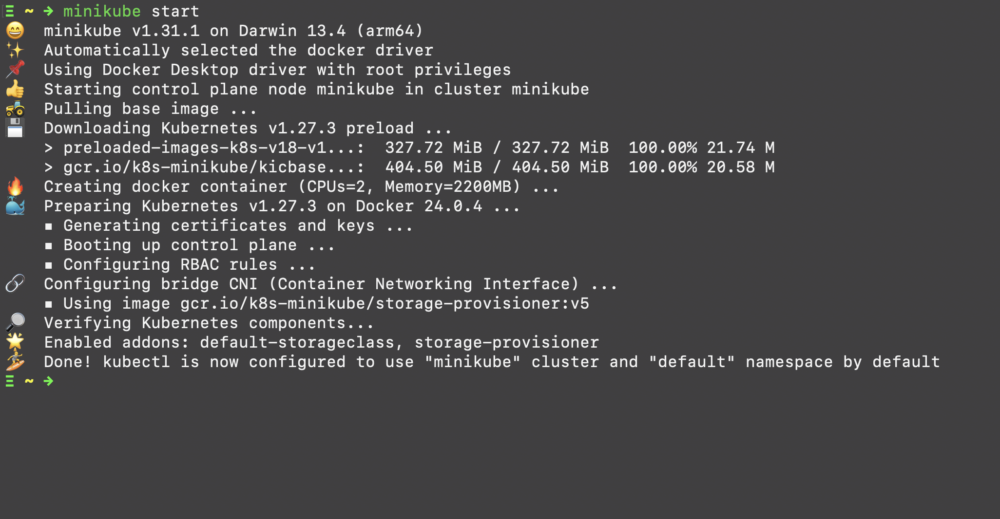

```bash
kubectl run hello-world --image=amigoscode/kubernetes:hello-world --port=80
kubectl port-forward --port=8080
```

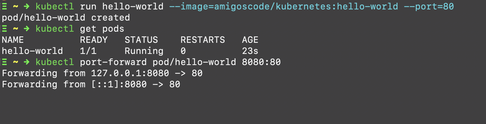

```bash
kubectl delete pod hello-world
kubectl get pods
kubectl get pods -A
```

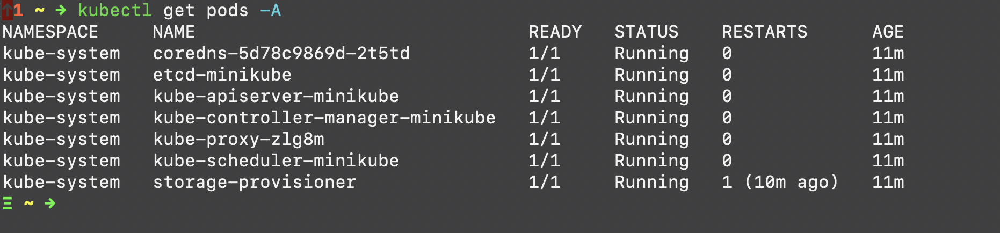

```bash
minikube ssh
minikube stop
minkube delete

minikube start --nodes=2
```

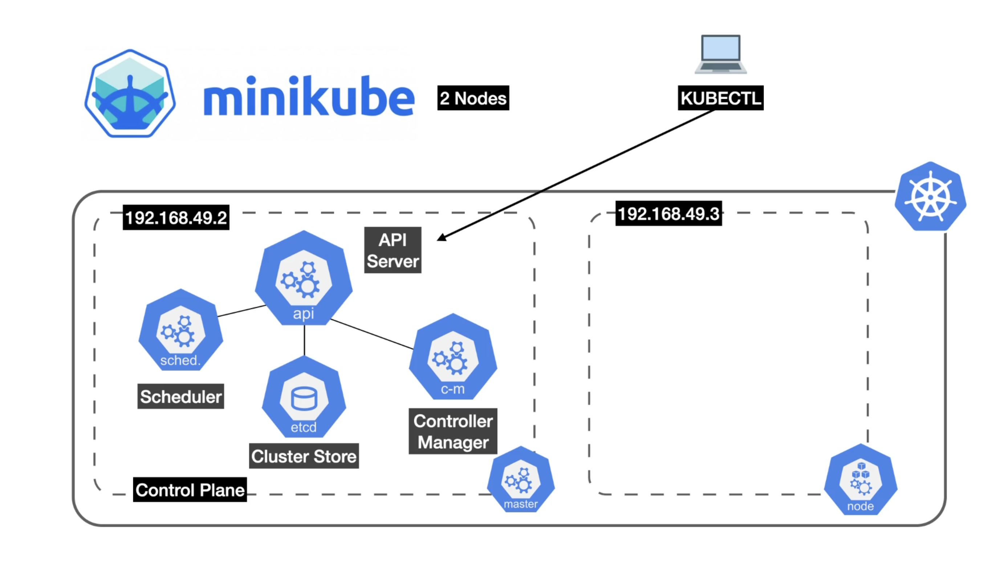

```bash
minikube get nodes
minikube ip
minikube ip --node=minikube-m01
minikube stats
minikube logs
minikube logs -f
minkube logs --node=minikube-m01 -f
```

## Pod

Smallest deployable unit - part of a node. ie worker node. The control plane (master node) has its on unique pods necessary for running k8 functionalities.

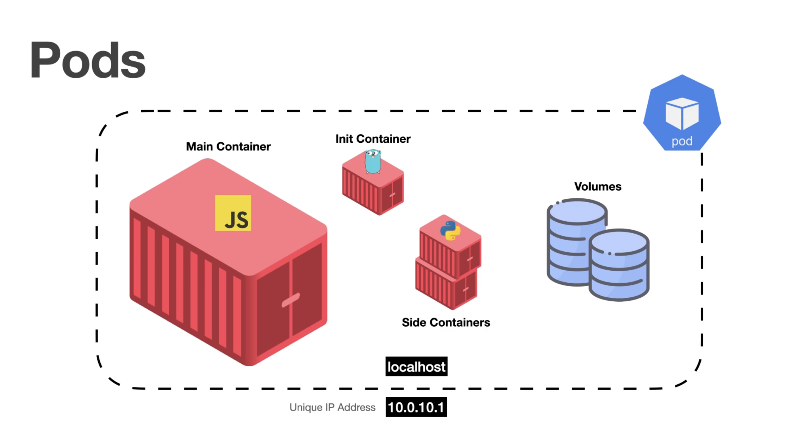

```yaml
apiVersion: v1
kind: Pod
metadata:
  name: hello-world
  labels:
    name: hello-world
spec:
  containers:
  - name: hello-world
    image: amigoscode/kubernetes:hello-world
    resources:
      limits:
        memory: "128Mi"
        cpu: "500m"
    ports:
      - containerPort: 80
```

```bash
kubectl apply -f pod.yaml # create pod declaratively
cat pod.yaml | kubectl apply -f - # apply from piped content
kubectl apply -f . # apply all k8 resource files
kubectl get pods -w # watch the running status of pods as they update

kubectl delete -f pod.yaml 
```

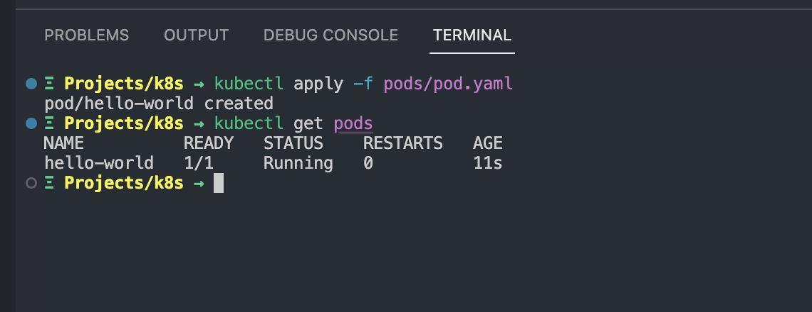

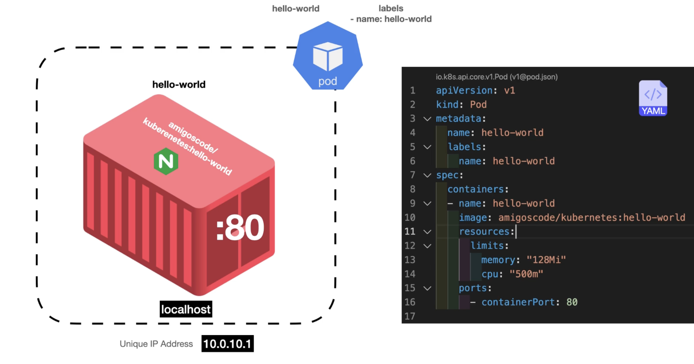

```bash
kubectl get all # get all resources. shows the clusters
kubectl get all -A # get all resources including pods, services with clusters etc

kubectl get pods -n kube-system # pods for only kube-system namespace. Excludes default
kubectl get all -n kube-system
kubectl get namespaces # or
kubectl get ns

kubectl describe pod hello-world # describe pod
kubectl get pod hello-world -o wide # describes pod in one line. --output
# wide, json, yaml
```

**Logs**

```bash
kubectl logs hello-world
kubectl logs hello-world -f

# to target the logs for a specific container inside the pod,
kubectl logs hello-world -c hello-world
```

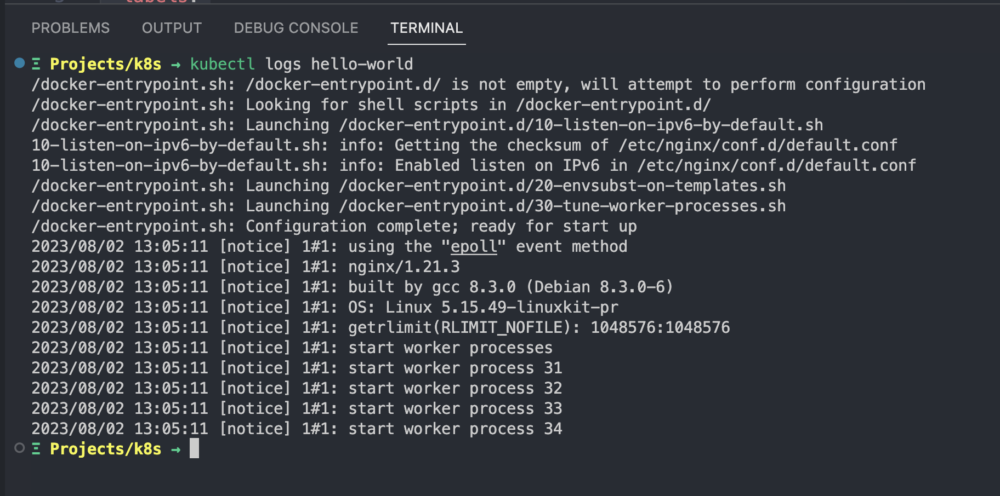

**A pod with two containers**

```yaml
apiVersion: v1
kind: Pod
metadata:
  name: hello-world
  labels:
    name: hello-world
spec:
  containers:
  - name: hello-world
    image: amigoscode/kubernetes:hello-world
    resources:
      limits:
        memory: "128Mi"
        cpu: "500m"
    ports:
      - containerPort: 80
	- name: ola-mundo
    image: amigoscode/kubernetes:hello-world
    resources:
      limits:
        memory: "128Mi"
        cpu: "500m"
    ports:
      - containerPort: 82
```

**Executing** **commands**

```yaml
kubectl exec -it hello-world -- sh
#_

kubectl exec -it hello-world -c hello-world -- /bin/sh
kubectl exec hello-world -- ls

kubectl api-resources
```

cheat sheet [here](https://kubernetes.io/docs/reference/kubectl/cheatsheet/)

### Deployments

```yaml
apiVersion: apps/v1
kind: Deployment
metadata:
  name: hello-world
spec:
  selector:
    matchLabels:
      app: hello-world
  template:
    metadata:
      labels:
        app: hello-world
    spec:
      containers:
      - name: hello-world
        image: amigoscode/kubernetes:hello-world
        resources:
          limits:
            memory: "128Mi"
            cpu: "500m"
        ports:
        - containerPort: 80
```

```bash
kubectl apply -f deployments/deployment.yaml
kubectl get po
kubectl get deployments
kubectl describe deployments hello-world
kubectl delete deployment hello-world
```

### ReplicaSet w/ Deployment

By default, a deployment comes with one replicaset

```bash
kubectl get replicaset # or rs
kubectl port-forward deployment/hello-world 8081:80
```

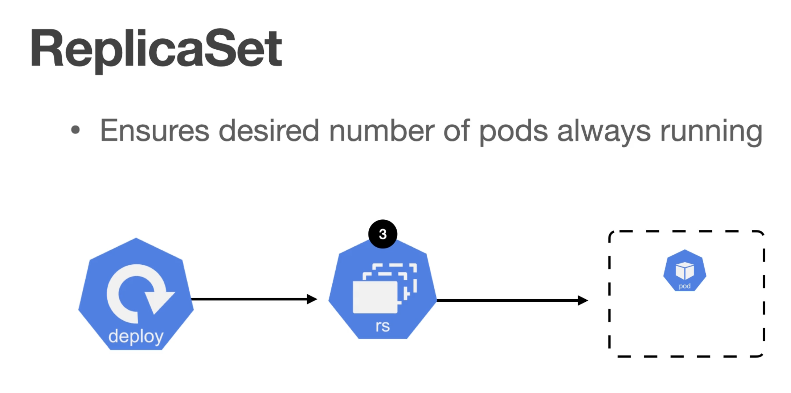

```bash
...
# add to deployment file
spec:
  replicas: 3
...

kubectl apply -f deployments/deployment.yaml
kubectl get pods
# or use this to get all stats together
kubectl get all
```

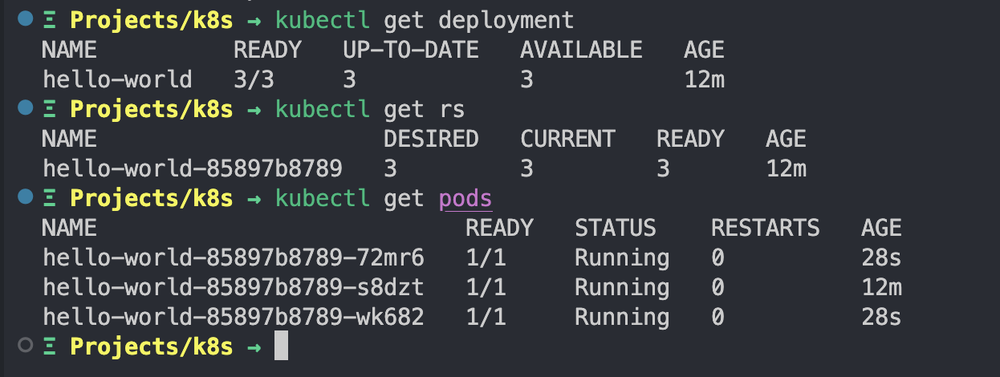

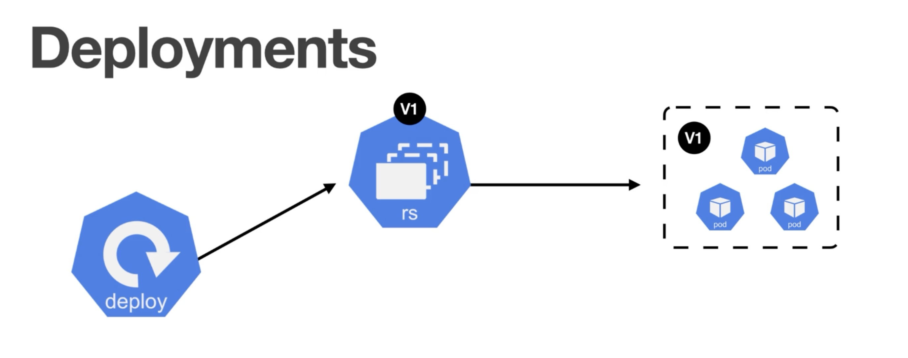

```bash
kubectl describe rs hello-world

kubectl rollout history deployment hello-world
kubectl rollout undo deployment hello-world
```

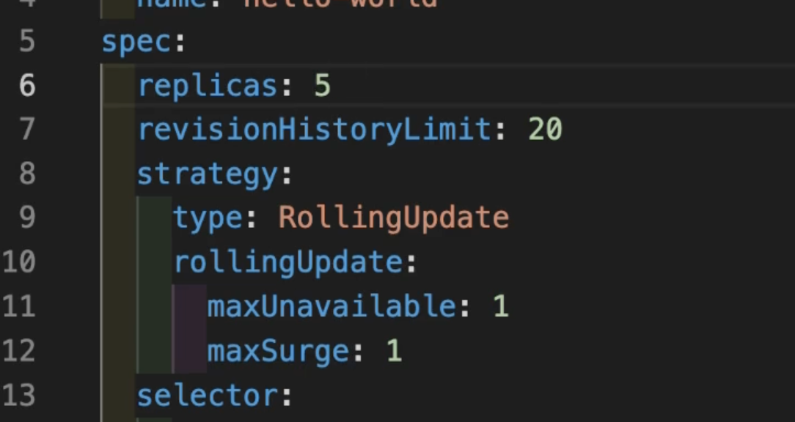

**Services**

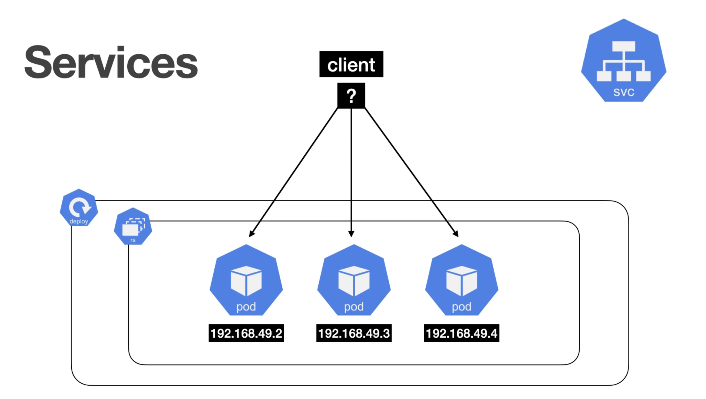

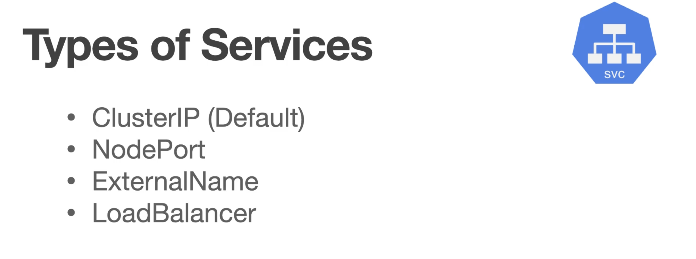